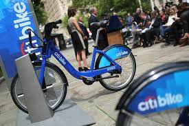
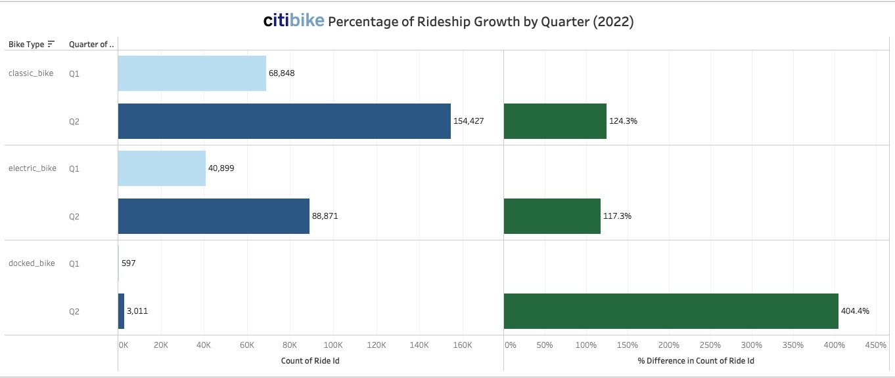
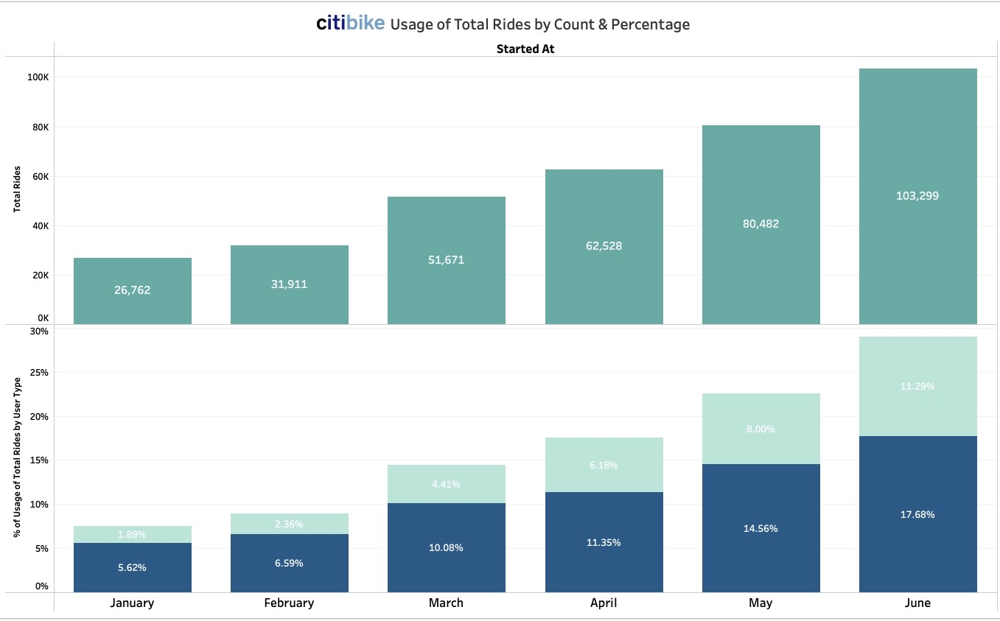
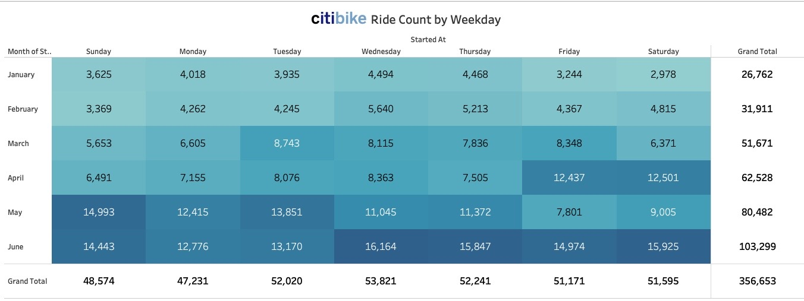
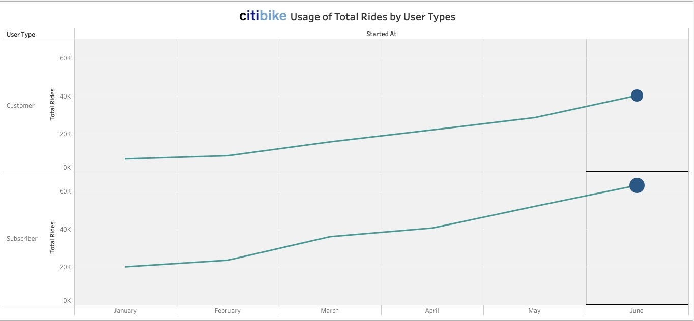
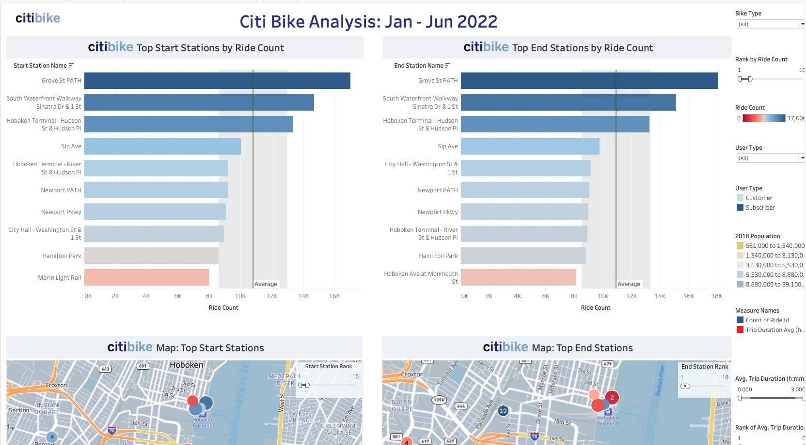
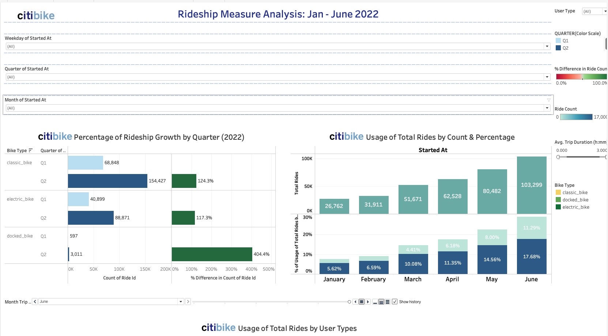
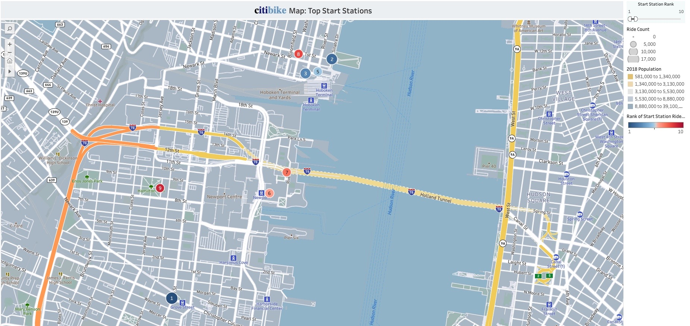
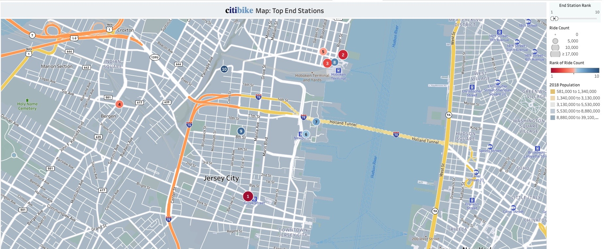
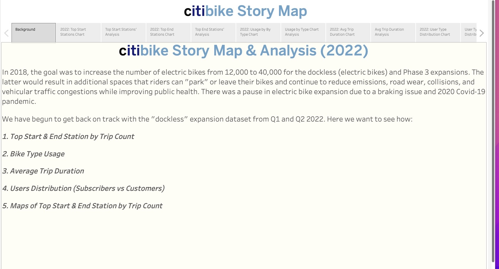

# citi_bike_tableau

 
 

## Tableau Reports, Dashboard, & Story 
- [citi bike Tableau Online](https://public.tableau.com/app/profile/tanisha.cooper/viz/citibiketableau/PercentageofRideshipGrowthbyQuarter)
- [citi bike Tableau Resource](./Tableau/citibike%20tableau.twbx)

## Background

As a new employee for NY Citi Bike Program, I am responsible for overseeing the largest bike-sharing program in the United States. In the new role, I am expected to generate regular reports for city officials looking to publicize and improve the city program. 

Since 2013, the Citi Bike Program has implemented a robust infrastructure for collecting data on the program's utlization. Each month, bike data is collected, organized, and made public on the [Citi Bike Data](https://www.citibikenyc.com/system-data) webpage.

The data has been regularly updated, but the team has yet to implement a dashboard or sophisticated reporting process. City officials have questions about the program, so the first task on the job is to build a set of data reports using <strong>Tableau</strong> to provide answers to the following: 

1. <strong>Top Start & End Station by Trip Count</strong>
    - <em>Grove St. Path</em> (Both Top Station for Start and End by Trip)
 
 
2. <strong>Bike Type Usage</strong>
    - <em>For each bike type (rideable type), there was approximately 125% to 400% growth in usage (utilization by a count of ride id). % Difference from total ride count were all in <strong>"green"</strong>, indicating that we have high positive utilization in Q2 compared to Q1.</em>
 
 

3. <strong>Average Trip Duration</strong>
    - <em>The Bike Type filter keeps classic_bike, docked_bike, and electric_bike. The average Trip Duration (h: mm) filter ranges from 0.000 to 3.000. Avg trip duration by month with all bike types: 1.05 (h: mm). June showed a top trip duration of 1.23 (h: mm).</em>
 
 
4. <strong>Users Distribution (Subscribers vs Customers)</strong>
    - <em><strong>Overall Analysis:</strong> Consistent increase (approx. 3.6%) in both user typer month to month by the percentage of total ride count, which infers a steady increase in revenue. The projection for Dec 2022 shows ~51% for both user-type bike usage. Confirm a significant increase in subscribers month-to-month for all bike types. June showed the most increase in bike usage of +63,000 according to subscriber user type.</em> 

    -   <em><strong>Electric Bike Type:</strong> An avg 4.4% increase in bike usage from month-to-month shows a forecast of ~56% of bike usage by Dec 2022. By subscribers, there showed an avg increase of 2.27% in bike usage. Dec 2022 bike usage by subscribers is projected to be at 29.88%. March had the least amount of percentage change for bike usage for subscribers, whereas April had the greatest percentage of usage by subscribers. Customers' electric bike usage showed an avg of 2.12% increase month to month with a significant increase in summer month (June). Customers' data showed a consistent increase in electric bike usage from winter to spring to summer months, from 0.5% to1.34% to 3.76% respectively. By Dec 2022, electric bike usage is projected to show 25.96% of total rides.</em> 

    - <em><strong>Customer:</strong> Customer has an avg of ~2% (1.88%) month-to-month. We can forecast that user-type customers would increase to approx. ~23% by Dec 2022.</em>

    - <em><strong>Subscriber:</strong> Subscribers have an avg of 2.4% (2.41%) month-to-month. We can forecast that user-type customers would increase to approx. ~32% by Dec 2022.</em>
 
 
5. <strong>Maps of Top Start & End Station by Trip Count</strong>

## Process & Analysis
1. Aggregate the data found in the Citi Bike Trip History Logs and
    - Used Python, Pandas, and Functools to merge Q1 & Q2 data
    - Uploaded merged [citi bike data](./Resources/citi_bike_merge.xlsx) into <strong>Tableau Public</strong>
 
 
2. Design 2-5 visualizations for each discovered phenomenon (see [citi bike Tableau](./Tableau/citibike%20tableau.twbx) to download workbook or [citi bike Tableau Online](https://public.tableau.com/app/profile/tanisha.cooper/viz/citibiketableau/PercentageofRideshipGrowthbyQuarter))
    - i.e. Aligned with Phenomenon 1:
     
    
    
     
    
 
 
3. Find two unexpected phenomena from data 
    - January - June 2022 (Q1 & Q2) History Logs were chosen
        *   Phenomenons & Analysis
            1. Consistent increase (approx. 3.6%) in both user-type month to month by the percentage of total ride count, which infers a steady increase in revenue. The projection for Dec 2022 shows ~51% for both user-type bike usage.
            
            2. <strong>Members</strong> (subscribers), annual membership users, utilization from Q1 to Q2 increased by an avg of 95% using classic and electric bikes. (No data showed docked bike users when a member (subscribers) was filtered.) <strong>Casual</strong> (customers), 24-hour pass, or 3-day pass users, had a much higher utilization range of percentage from Q1 to Q2. On avg, classic, docked, and electric bike utilization increased on avg 260%. Customers are likely to convert to subscribers, as inferred by the high percentage of increase from Q1 to Q2.

            3. For each bike type (rideable type), there was a range from 125% to 400% growth in usage (utilization by the count of ride id). % Difference from total ride count were all in "green", indicating that we have high positive utilization in Q2 compared to Q1.

            4. 
Wednesday has the most ride count (bike usage) overall for Q1 & Q2, with June having the highest month of bike usage. <strong>Weekday Ranking:</strong>  Wednesday, Thursday, Tuesday, Saturday, Friday, Sunday, & Monday <strong>Monthly Ranking:</strong> June, May, April, March, February, January

            5.  The average Trip Duration (h: mm) filter ranges from 0.000 to 3.000. Avg trip duration by month with all bike types: 1.05 (h: mm). June showed a top trip duration of 1.23 (h: mm). 

4. Use report visualizations to create a dashboard accompanied by an analysis explaining why the phenomenon may be occuring

5. Create a static or dynamic map that shows how each stations' popularity changes over time (month over month)

6. Create a Tableau Story that brings together the visualizations, requested maps, and dashboards
